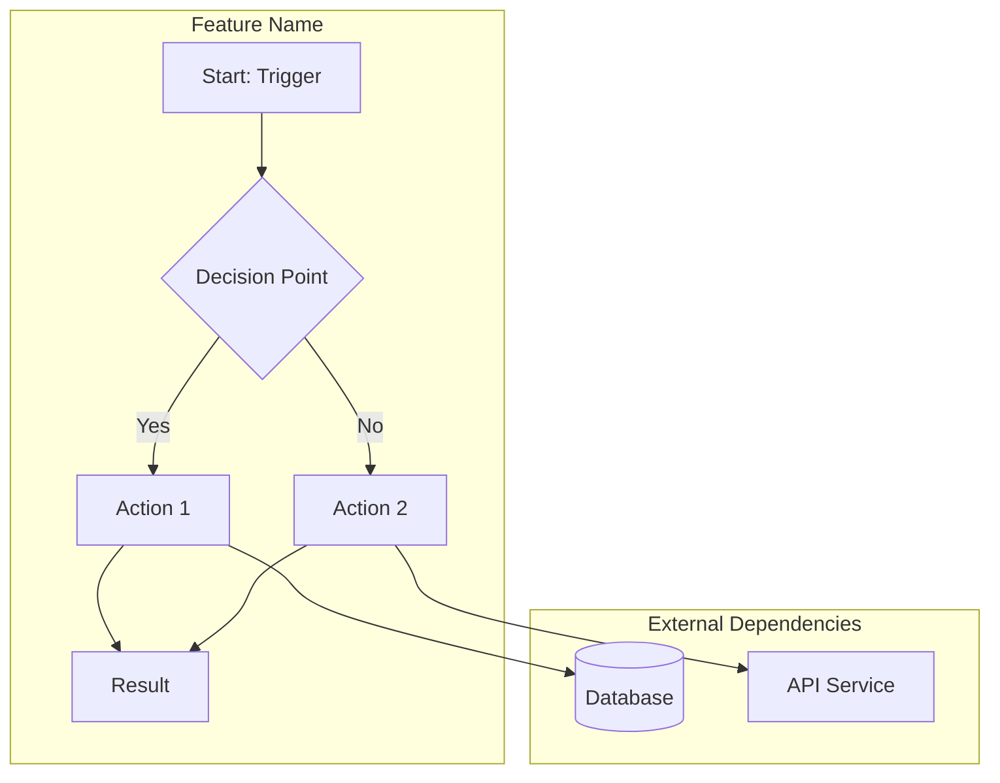
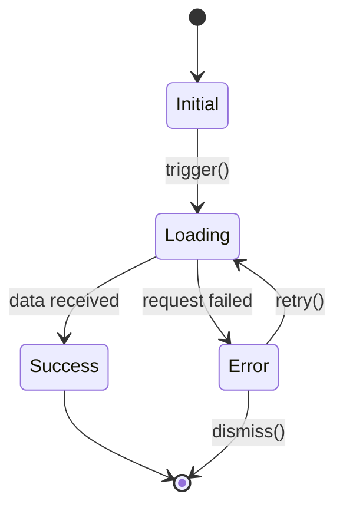
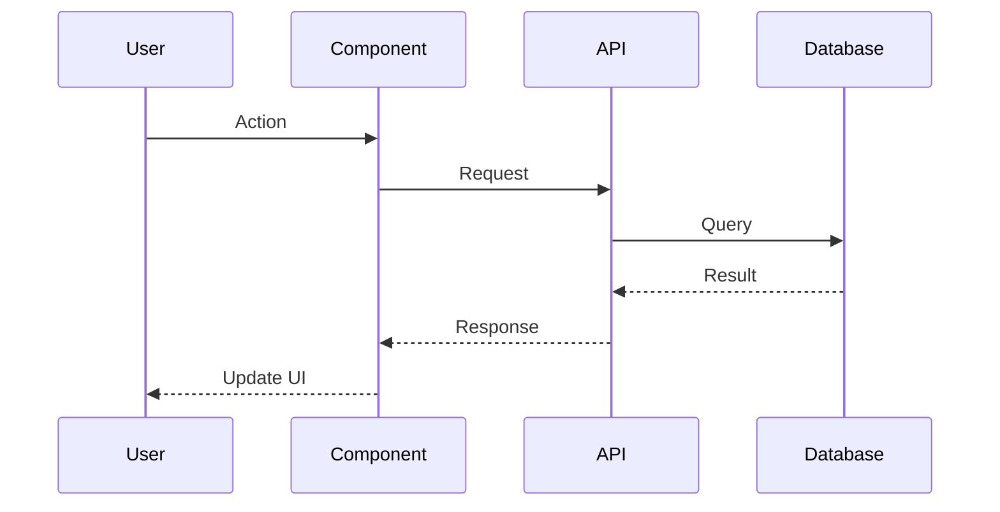

# Diagram-First Architecture Skill

> **CORE PRINCIPLE**: No code is written until the user explicitly approves a visual diagram of the proposed implementation.

## When This Skill Activates

This skill should be applied when:
- User requests a new feature implementation
- User requests architectural changes
- User requests refactoring that changes flow
- User requests bug fixes that require understanding the flow
- ANY non-trivial implementation task

## Workflow Overview

```
┌─────────────────────────────────────────────────────────────────┐
│  1. ANALYZE    →  Understand the request, explore codebase      │
│  2. DIAGRAM    →  Create appropriate Mermaid diagram(s)         │
│  3. PRESENT    →  Show diagram with explanation                 │
│  4. AWAIT      →  Wait for explicit approval/rejection          │
│  5. IF REJECT  →  GRILL: Ask detailed questions, iterate        │
│  6. IF APPROVE →  Save diagram, proceed to implementation       │
└─────────────────────────────────────────────────────────────────┘
```

---

## Phase 1: ANALYZE

Before creating any diagram, gather context:

1. **Read the request carefully** - What is being asked?
2. **Explore relevant code** - Use Glob/Grep/Read to understand:
   - Existing patterns
   - Related components
   - Data flow
   - State management
3. **Identify diagram type needed**:

| Scenario | Diagram Type |
|----------|--------------|
| Process/workflow | Flowchart |
| Component states | State Diagram |
| API/service interactions | Sequence Diagram |
| Data models/relationships | Entity Relationship |
| System components | C4 or Component Diagram |
| Multiple aspects | **Create ALL relevant types** |

---

## Phase 2: DIAGRAM

Create Mermaid diagram(s) following these rules:

### Flowchart Template


### State Diagram Template


### Sequence Diagram Template


### Diagram Requirements

1. **Be specific** - Use actual component/function names from codebase
2. **Show all paths** - Include error cases, edge cases
3. **Label transitions** - What triggers each state change?
4. **Mark external deps** - Database, APIs, services
5. **Include data** - What data flows at each step?

---

## Phase 3: PRESENT

Display the diagram with context:

```markdown
## Proposed Architecture: [Feature Name]

### Overview
[1-2 sentence summary of what this implements]

### Diagram

[Mermaid diagram here]

### Key Design Decisions

1. **[Decision 1]**: Why this approach
2. **[Decision 2]**: Why this approach
3. **[Decision 3]**: Why this approach

### Components Affected
- `path/to/file1.ts` - [What changes]
- `path/to/file2.ts` - [What changes]

### Data Flow
1. [Step 1 description]
2. [Step 2 description]
3. [Step 3 description]

---

**Do you approve this design?** (yes/no)

If no, I will ask detailed questions to understand exactly what you want.
```

---

## Phase 4: AWAIT APPROVAL

Use `AskUserQuestion` with options:

```
question: "Do you approve this architecture design?"
options:
  - label: "Yes, proceed with implementation"
    description: "The diagram accurately represents what I want built"
  - label: "No, this needs changes"
    description: "I'll explain what's wrong or different from my vision"
  - label: "Partially - needs refinement"
    description: "Close but some aspects need adjustment"
```

---

## Phase 5: GRILL (If Rejected)

**THIS IS CRITICAL**: If the user rejects, do NOT guess what they want. Instead, systematically interrogate EVERY aspect:

### The Grill Protocol

Ask questions in batches of 2-3. Cover ALL of these areas:

#### 1. Purpose & Goals
- "What is the PRIMARY goal of this feature?"
- "What problem does this solve for the user?"
- "What does SUCCESS look like?"

#### 2. Trigger & Entry Points
- "What EXACTLY triggers this flow?"
- "Can it be triggered from multiple places?"
- "What state must exist BEFORE this can start?"

#### 3. Steps & Sequence
- "Walk me through the EXACT steps, in order"
- "What happens after [specific step]?"
- "Are any steps optional? Which ones?"

#### 4. Decision Points
- "At [point X], what determines which path is taken?"
- "What are ALL the possible outcomes at [decision point]?"
- "Who/what makes this decision - user, system, or external?"

#### 5. Data & State
- "What data is REQUIRED at each step?"
- "What data is CREATED or MODIFIED?"
- "Where does this data come from? Where does it go?"

#### 6. Error Cases
- "What happens if [step X] fails?"
- "Should failures be retryable? Auto-retry? Manual?"
- "What should the user see when errors occur?"

#### 7. Edge Cases
- "What if the user [unusual action]?"
- "What if [external dependency] is unavailable?"
- "What about concurrent requests / race conditions?"

#### 8. Integration
- "How does this interact with [existing feature]?"
- "Should this replace, extend, or work alongside [X]?"
- "What existing behavior should NOT change?"

### Grill Rules

1. **Never assume** - If unclear, ASK
2. **Be specific** - Reference exact points in rejected diagram
3. **One topic at a time** - Don't overwhelm
4. **Confirm understanding** - "So you're saying [X], correct?"
5. **Iterate diagram** - After each batch of answers, UPDATE the diagram

---

## Phase 6: SAVE & PROCEED

Once approved:

1. **Save the diagram** to `.claude/diagrams/[feature-name].md`:

```markdown
# [Feature Name] - Architecture Diagram

**Created**: [timestamp]
**Status**: APPROVED
**Related Files**: [list of files that will be modified]

## Diagram

[Approved Mermaid diagram]

## Design Decisions

[List of key decisions and rationale]

## Implementation Notes

[Any clarifications from the grill phase]
```

2. **Create/Update TODO list** with implementation tasks
3. **Reference the diagram** during implementation

---

## Quick Reference: Diagram Types

| Need to Show | Use This |
|--------------|----------|
| Step-by-step process | `flowchart TD` |
| UI states & transitions | `stateDiagram-v2` |
| API call sequences | `sequenceDiagram` |
| Database relationships | `erDiagram` |
| System components | `flowchart LR` with subgraphs |
| Class relationships | `classDiagram` |

---

## Anti-Patterns (NEVER DO)

1. **Never skip the diagram** - Even for "simple" changes
2. **Never proceed on partial approval** - Must be explicit YES
3. **Never guess after rejection** - Always grill
4. **Never create vague diagrams** - Use real names from code
5. **Never skip error/edge cases** - Always include them

---

## Example Grill Session

User rejects diagram for "Add cart checkout flow"

**Claude**: "I want to understand exactly what you need. Let's start with the basics:

1. When the user clicks 'Checkout', what is the FIRST thing that should happen?
2. Should the user be required to log in, or can guests checkout?"

**User**: "First validate cart isn't empty. Guests can checkout but must enter email."

**Claude**: "Got it. So:
- Step 1: Validate cart not empty
- Guest checkout allowed with email required

Next questions:
3. After cart validation, what's the next step - shipping address or payment?
4. Should we save the email/address for guests to use later if they create an account?"

[Continue until ALL aspects are clear, then regenerate diagram]

---

## Integration with Other Skills

- **After /prd**: Use diagram-first before implementation phase
- **Before /feature-dev Phase 5**: Create diagram, get approval
- **With /planning-parallel**: Include approved diagram in task context
